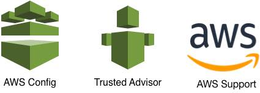

### AWS Config
[AWS Config](https://aws.amazon.com/config/) is a service that enables you to assess, audit, and evaluate the configurations of your AWS resources. Config continuously monitors and records your AWS resource configurations and allows you to automate the evaluation of recorded configurations against desired configurations. With Config, you can review changes in configurations and relationships between AWS resources, dive into detailed resource configuration histories, and determine your overall compliance against the configurations specified in your internal guidelines. This enables you to simplify compliance auditing, security analysis, change management, and operational troubleshooting.

### AWS Trusted Advisor
[AWS Trusted Advisor](https://www.aws.amazon.com/trusted-advisor) is an online resource to help you reduce cost, increase performance, and improve security by optimizing your AWS environment, Trusted Advisor provides real time guidance to help you provision your resources following AWS best practices.

### Kumo 
AWS Support tools development team. We enable support engineers to assist AWS customers. 

